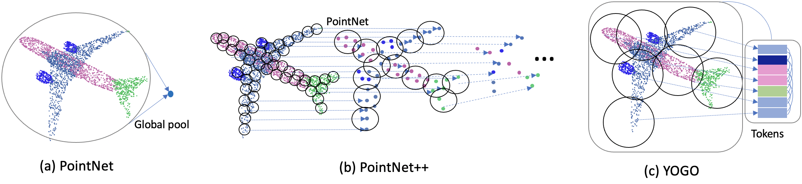
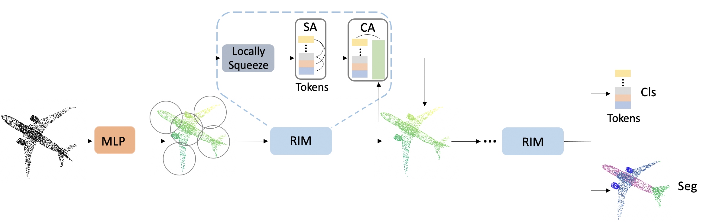

# You Only Group Once: Efficient Point-Cloud Processing with Token Representation and Relation Inference Module
By Chenfeng Xu, Bohan Zhai, Bichen Wu, Tian Li, Wei Zhan, Peter Vajda, Kurt Keutzer, and Masayoshi Tomizuka.

<p align="center">
    
</p>


This repository contains a Pytorch implementation of YOGO, a new, simple, and elegant model for point-cloud processing. The framework of our YOGO can be found below:

<p align="center">
    
</p>

Selected quantitative results of different approaches on the ShapeNet and S3DIS dataset.

### ShapeNet part segmentation:

|   Method       | mIoU | Latency (ms) | GPU Memory (GB)|
| ---------------|------|--------------|----------------|
| PointNet       | 83.7 |21.4          | 1.5            |
| RSNet          | 84.9 | 73.8         | 0.8            |
| PointNet++     | 85.1 |77.7          | 2.0            |
| DGCNN          | 85.1 |86.7          | 2.4            |
| PointCNN       | 86.1 |134.2         | 2.5            |
| YOGO(KNN)      | 85.2 |25.6          | 0.9            |
|YOGO(Ball query)| 85.1 |21.3          | 1.0            |

### S3DIS scene parsing:

|   Method       | mIoU | Latency (ms) | GPU Memory (GB)|
| ---------------|------|--------------|----------------|
| PointNet       | 42.9 |24.8          | 1.0            |
| RSNet          | 51.9 |111.5         | 1.1            |
| PointNet++*    | 50.7 |501.5         | 1.6            |
| DGCNN          | 47.9 |174.3         | 2.4            |
| PointCNN       | 57.2 |282.4         | 4.6            |
| YOGO(KNN)      | 54.0 |27.7          | 2.0            |
|YOGO(Ball query)| 53.8 |24.0          | 2.0            |

If you find this work useful for your research, please consider citing:

```
@article{xu2021you,
  title={You Only Group Once: Efficient Point-Cloud Processing with Token Representation and Relation Inference Module},
  author={Xu, Chenfeng and Zhai, Bohan and Wu, Bichen and Li, Tian and Zhan, Wei and Vajda, Peter and Keutzer, Kurt and Tomizuka, Masayoshi},
  journal={\},
  year={2021}
}
```

```
@article{xu2020squeezesegv3,
  title={SqueezeSegV3: Spatially-Adaptive Convolution for Efficient Point-Cloud Segmentation},
  author={Xu, Chenfeng and Wu, Bichen and Wang, Zining and Zhan, Wei and Vajda, Peter and Keutzer, Kurt and Tomizuka, Masayoshi},
  journal={arXiv preprint arXiv:2004.01803},
  year={2020}
}
```

## License
**YOGO** is released under the BSD license (See [LICENSE](https://github.com/chenfengxu714/YOGO/blob/master/LICENSE) for details).

## Installation

The instructions are tested on Ubuntu 16.04 with python 3.6 and Pytorch 1.5 with GPU support.

* Clone the YOGO repository:


```shell
git clone https://github.com/chenfengxu714/YOGO.git
```

* Use pip to install required Python packages:

```shell
pip install -r requirements.txt
```

* Install KNN library:

```shell
cd convpoint/knn/
python setup.py install --home='.'
```


* Click to download [ShapeNet](https://www.shapenet.org) and [S3DIS](https://web.archive.org/web/20200707221857/http://buildingparser.stanford.edu/dataset.html#Download) dataset.


## Pre-trained Models

The pre-trained YOGO on the two datasets are avaliable at [Google Drive] (), you can directly download the two files.

## Inference
To infer the predictions for the entire dataset:

```shell
python train.py [config-file] --devices [gpu-ids] --evaluate --configs.evaluate.best_checkpoint_path [path to the model checkpoint]
```

for example, you can run the below command for ShapeNet inference:

```shell
python train.py configs/shapenet/yogo/yogo.py --devices 0 --evaluate --configs.evaluate.best_checkpoint_path [path to the model checkpoint]
```


## Training:
To train the model:

```shell
python train.py [config-file] --devices [gpu-ids] --evaluate --configs.evaluate.best_checkpoint_path [path to the model checkpoint]
```

for example, you can run the below command for ShapeNet training:

```shell
python train.py configs/shapenet/yogo/yogo.py --devices 0
```

You can run the below command for multi-gpu training:

```shell
python train.py configs/shapenet/yogo/yogo.py --devices 0,1,2,3
```

Note that we conduct training on Titan RTX gpu, you can modify the batch size according your GPU memory, the performance is slightly different.

## Acknowledgement:
The code is modified from [PVCNN](https://github.com/mit-han-lab/pvcnn) and the code for KNN is from [Pointconv](https://github.com/aboulch/ConvPoint/tree/master/convpoint).

